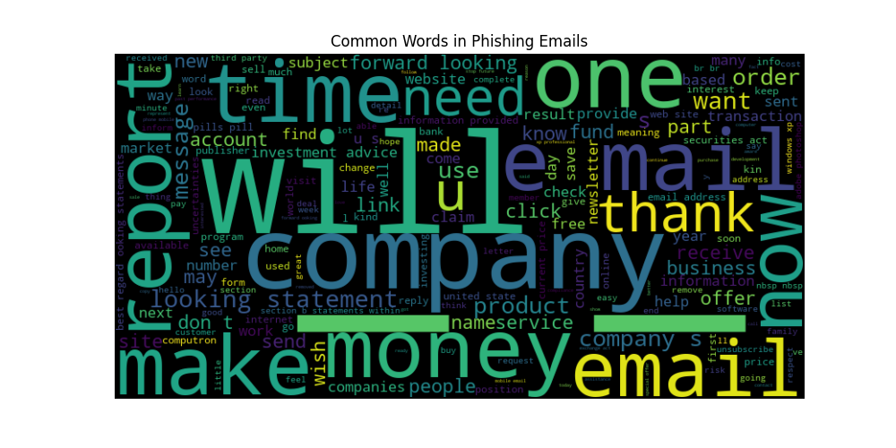
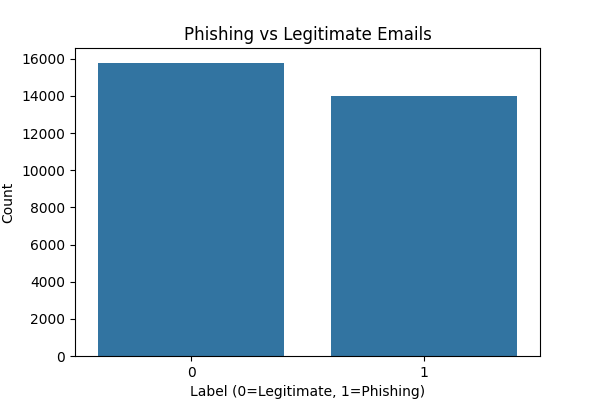
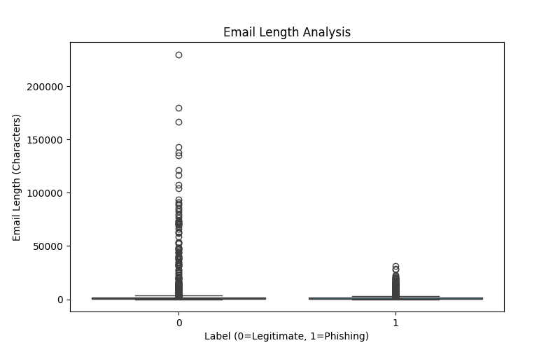
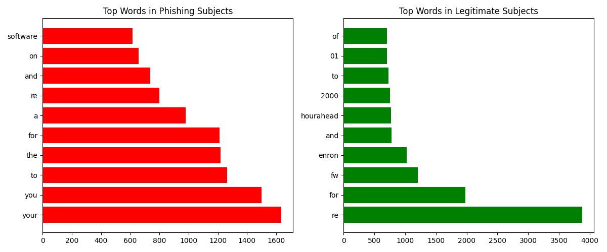

# Email Phishing Detection Visualizations



## 📌 Overview
This project analyzes the Enron email dataset to visualize key differences between phishing and legitimate emails. The visualizations help identify patterns that can improve phishing detection systems.

## 📊 Visualizations

### 1. Email Class Distribution

- Shows the proportion of phishing (1) vs legitimate (0) emails
- Helps assess dataset balance for machine learning

### 2. Phishing Word Cloud

- Visualizes most frequent words in phishing emails
- Larger words = more frequent appearances
- Reveals common phishing vocabulary patterns

### 3. Email Length Analysis

- Compares character length of email bodies
- Shows median and distribution of lengths
- Phishing emails often have distinct length patterns

### 4. Subject Line Word Frequency

- Compares top words in phishing vs legitimate subjects
- Highlights suspicious subject line patterns

## 🛠️ Setup & Usage

### Requirements
- Python 3.6+
- Required packages: `pandas`, `matplotlib`, `seaborn`, `wordcloud`

### Installation
```bash
pip install pandas matplotlib seaborn wordcloud
